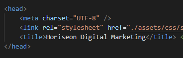
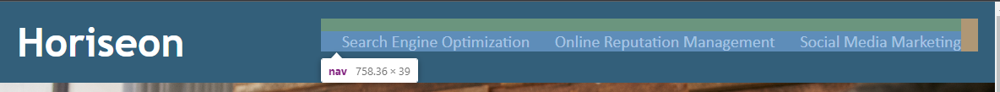
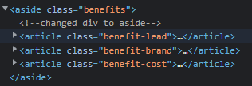
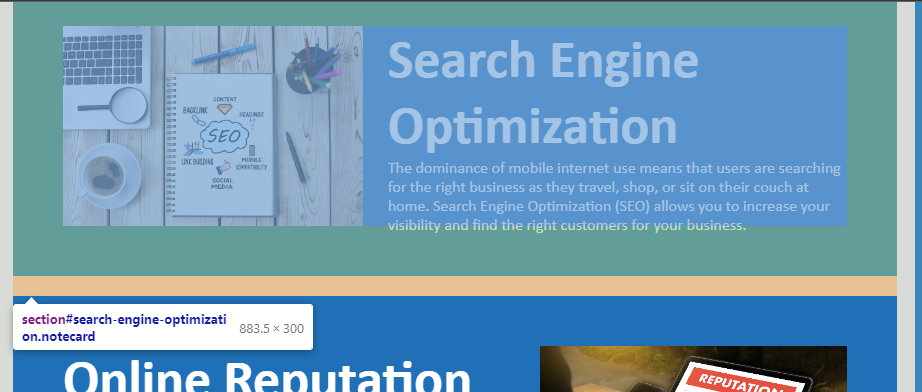
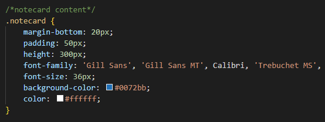
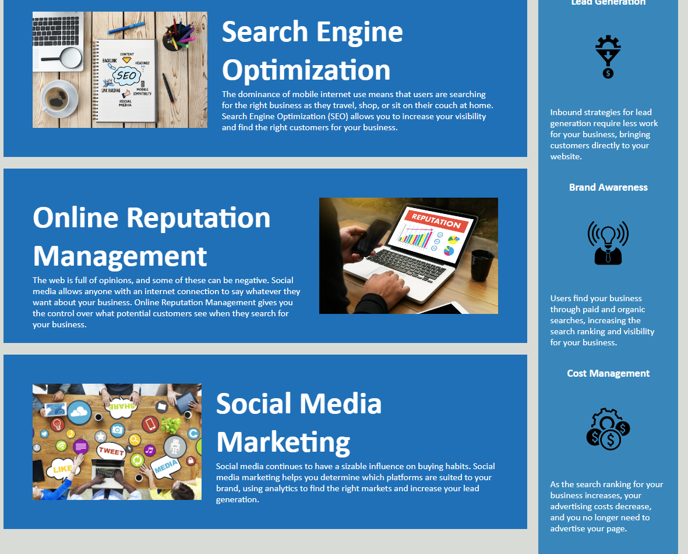

# week-1-challenge
Edit a marketing site to meet accessibility standards:
https://sdoval27.github.io/week-1-challenge/

## Description

- This digital marketing site has been edited to meet accessibility standards. When editing this site, five issues were addressed as stated below:

### The Title Element: 
The title element in the head of the HTML file was changed from "website" to "Horiseon Digital Marketing" to improve SEO.

### Accessibility:
- Detailed alt descriptions were added to all images that appear on the website.

### HTML Semantics:
- Sections previously marked as "div" were renamed to define their appropriate function on the page. 

- The navigation within the header was renamed "nav". All the links on the nav bar relocate the user to their respective sections within the page.

- The sidebar was renamed "aside" and the contents within were renamed "article."

- The main section of the website was renamed "main", and the content enclosed were renamed to "section."

- Headers < h1 > through < h4 > were organcized in descending order on the HTML page.

### CSS Changes:
- CSS elements were rearranged to match the order they appear in the HTML file.
- Styling content for the three sections under main were consolidated and renamed "notecard" due to the notecard-type styling of the sections.

## Installation

N/A
 
## Usage
When opening the page, the website should appear as so:

clicking on the links in the navigation bar will direct the user to the lower half of the page.

 
## License
 
[MIT](https://choosealicense.com/licenses/mit/)

[def]: title-element.png